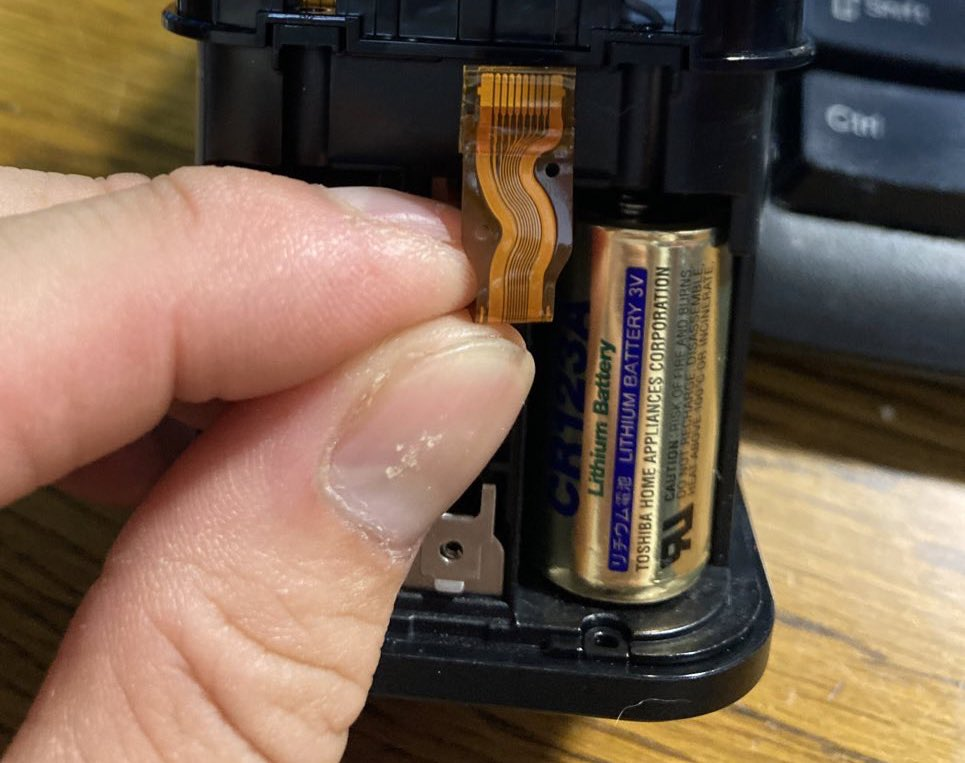
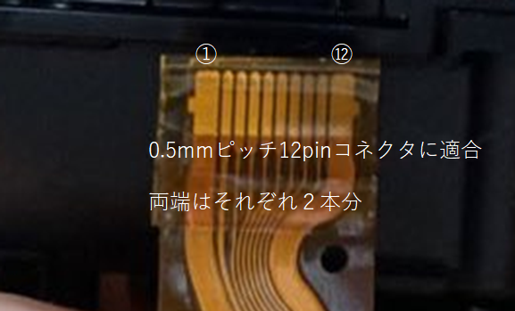
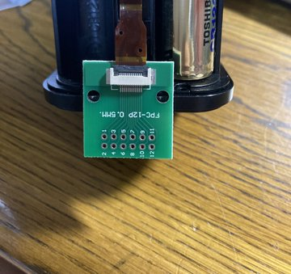

"# qriohack" 
# qriohack
Qrio Lock 初代(Q-SL1)をハックするための知見と
内蔵マイコンを書き換えるためのファームを生成するためのソースコードです

# どうやる
Windowsの場合
WICED-SDKをダウンロードしてきて、Apps以下にこのリポジトリ内のApps/obaqフォルダをコピーします
コマンドプロンプトから
> make obaq-BCM920737TAG_Q32

でビルドできるか確認

OKなら
> make obaq-BCM920737TAG_Q32 download UART=COMxx

で書き込み

WICED-SDKは
https://community.infineon.com/t5/Public-Archive/WICED-Smart-SDK-2-2-3-7z-Archive/td-p/247688

ここにある奴で確認済み
そのほかのバージョンやIDEにインポートするなら各自

# ピンアサイン
下面接続のFPC基板に取り付けた場合、この説明の番号と一致します  
|  No. |  Function  |
| ---- | ---- |
|  1,2  |  6V  |
|  3  |  3.3V  |
| 4 | RESET(NC:基板上ジャンパ)  
| 5 |SCL(NC:基板上ジャンパ)  |
| 6 | SDA(NC:基板上ジャンパ) |
| 7 |peripheral UART TXD in  |
| 8 |peripheral UART RXD out  |
| 9 |Programming RXD  |
| 10 |Programing TXD  |
| 11,12 |GND  |

1,2および3　は基板上の電源パターン直結のため、電池が入っているときの挙動に注意  
4,5,6は基板まで届いているが、基板上でジャンパがNCになっているのでそのままでは使用不可   
9,10と3,11,12の接続で書き込み可能。電源投入時に9をHighにしておくとProgrammingモードに入る   
